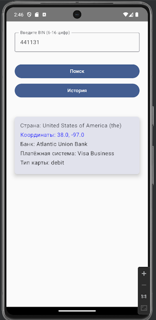
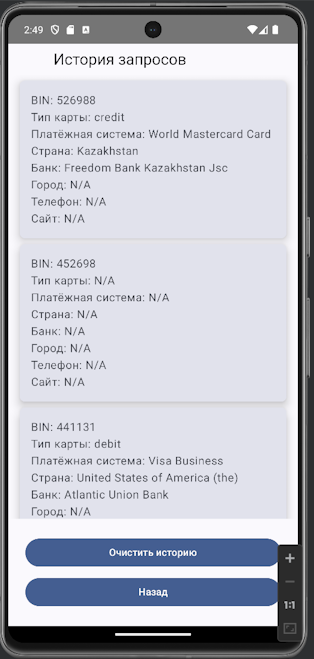

# BIN Information Lookup App

A simple and functional Android application for retrieving and displaying information about a bank card based on its BIN (Bank Identification Number). The application adheres to **Clean Architecture**, utilizes **MVVM**, and is built with **Jetpack Compose**.

---

## Features

### First Screen (Main Screen)
- **BIN Lookup**: Users can input a BIN to retrieve card details from the BinList API, such as:
  - **Country**
  - **Coordinates**
  - **Card type** (Visa, Mastercard, etc.)
  - **Bank information** (URL, phone, website, city)

- **Clickable Fields**:
  - **URL**: Opens the bank's website in a browser.
  - **Phone**: Opens the phone dialer with the bank's contact number.
  - **Coordinates**: Opens a map application to view the location.

- **History Navigation**: A button to navigate to the second screen displaying the history of BIN lookups.

---

### Second Screen (History Screen)
- **History List**: Displays a scrollable list of previously queried BINs with their respective details.
- **Persistent Storage**: History persists across app restarts.
- **History Management**:
  - Clear history with a button.
  - Confirmation message displayed after clearing history.

---

## Technology Stack
- **Kotlin**
- **MVVM Architecture**
- **Jetpack Compose**
- **Hilt (Dependency Injection)**
- **Coroutines**
- **Clean Architecture**

---

## How to Use
1. Open the app and navigate to the Main Screen.
2. Enter the BIN of a card to fetch its details.
3. Use the clickable fields (URL, phone, coordinates) for quick actions.
4. View the history of previous queries on the History Screen.
5. Clear the history using the "Clear History" button.

---

## Screenshots

### ___   Main Screen         _________________________                History Screen   ___
   

---

## Setup Instructions
1. Clone the repository:  
   ```bash
   git clone https://github.com/DT5GEN/EcoSystemTestApp.git
2. Open the project in Android Studio.
3. Build and run the app on an emulator or physical device.


   ---

## API Reference
- [BinList API](https://binlist.net/)  : Used to fetch BIN information.


---

   ## Contributing
Contributions are welcome! Please submit a pull request or open an issue for discussion.

